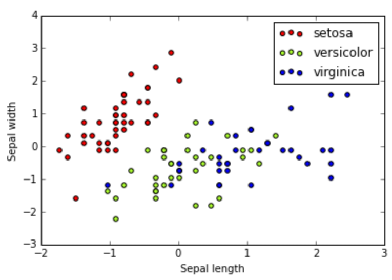

# Classifying Irisses

This is a classic [scikit-learn](http://scikit-learn.org/stable/index.html) example. Our goal is to identify what species an iris is, based on a couple of small measurements of an individual flower. We will do this using [Stochastic gradient descent](https://en.wikipedia.org/wiki/Stochastic_gradient_descent).

## Methods

TODO

## RESULTS

In the end, we choose only two variables to try and differentiate the three species of irises: sepal length and sepal width. Perhaps more variables would have given us better separation. As it stand, we defined the equation of three lines that separate one species from the other two. Though only one of these lines is particularly pleasing:

