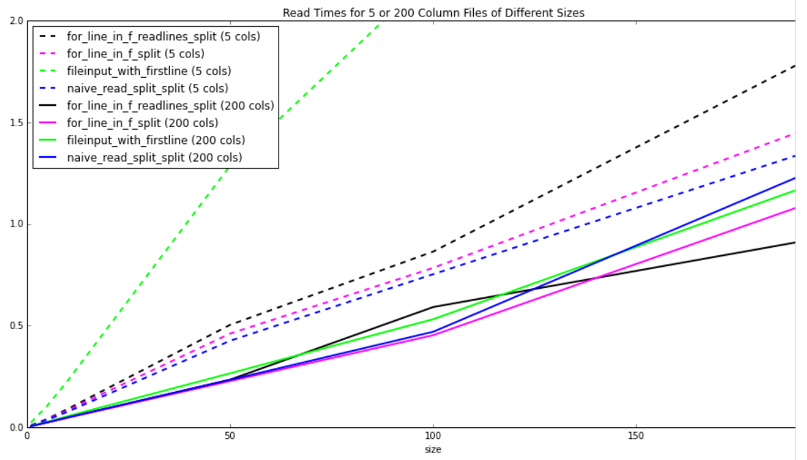

# The Fastest Way to Read a CSV File

It is extremely common to need to read CSV files and process them line by line. So it is worth our time to look at the various ways to do this. In this study, we will only look at files under ~200MB. Not because files larger than a GB are uncommon, but because the methods involved in reading files that are too large to fit into memory are different and the results start to depend heavily on how much memory you have.

There is a big parameter space for this problem. To start, we will break our study down into two components: the file, and the reading method. Obviously, the file size might affect the read time. But what about the number of columns? And we will consider as many different ways to read these files as we can think of.

Obviously, CSV files might contain numerical data. But in this instance we are not interested in testing the speed of conversion of strings to float or integers, so we will simply parse the lines into strings. (If you're interested, converting a string to a `float` is much faster than converting it to an `int` in Python.)

## Methods

You can find the Python script I used to run these tests [here](read_csv_test.py).

#### The File

We will test 90 different file sizes:

* **Number of Columns**: 5, 10, 50, 100, 200
* **File Size (MB)**: 1, 5, 10, 50, 100, 200

#### The Reading Method

There are many, many ways to read a text file in Python. This list is sure to not be exhaustive, but let's try several variations, just to see:

* `for line in f`
* `for line in f.readlines()` (In Python 3.x, or  `f.xreadlines()` in 2.x.)
* `pandas.read_csv`
* `for line in fileinput.input()`
* `csv.reader`
* `mmap`
* `numpy.genfromtxt`
* `numpy.fromfile`
* `split` vs `re`

Each of the above approaches will required lots of testing and variations to try and improve performance. I will try to keep as many of these around as possible for the final analysis. Though I expect I will find several dead ends.

Things that might still be worth trying:

* `numpy.fromfile` (doesn't appear to be able to read string types?)
* `numpy.load` (demands the file already be in a numpy pickle format)
* `fastcsv` (serious problems installing with pip)

#### How to Time the Test

We will use the [timeit](https://docs.python.org/2/library/timeit.html) module. Here is a toy example:

    >>> def costly_func(lst):
    ...     return map(lambda x: x^2, lst)
    ...
    >>>
    >>> def wrapper(func, *args, **kwargs):
    ...     def wrapped():
    ...         return func(*args, **kwargs)
    ...     return wrapped
    ...
    >>> short_list = range(10)
    >>> wrapped = wrapper(costly_func, short_list)
    >>> timeit.timeit(wrapped, number=1000)
    0.00409102439880371

The results would be more accurate with a higher `number` of iterations. And by default `timeit` uses a million iterations. But reading large text files takes seconds, not microseconds, so we will have to make do with fewer iterations.

## RESULTS

You can find the iPython script I used to analyze the results and make plots [here](read_csv_timing_analysis.ipynb). As you can see, plotting all lines for all the different CSV reading methods, for all different file sizes gets quite messy. So here is a reduced plot of just the fastest methods for large CSV files with 5 columns and 200 columns:

There are some important (though perhaps obvious results):

1. It doesn't matter if you `open` the file using `with`, there is no performance change.
2. If possible, more columns read faster for the same file size. Though you usually won't have control over this. This stems from the fact that file IO is slower than in-memory calculations (string parsing, in this case).

Finally, what methods were fastest?

It turns out, the fastest way to read a CSV file line-by-line is the standard library `f.readlines()` (or `f.xreadlines()` in Python 2.x). Followed closesly by a naive `f.readlines().split('\n')`. This result was quite suprising to me, as there are so many different (third-party) solutions to this problem. But none of them managed to improve upon the most basic standard library solution.

Now, there is a reason for this, these other libraries assume that you want to automate the process of parsing the line in the text file. For instance, the standard library `csv` module parses the line into a list or dictionary for you. And the `pandas` solutions for reading a CSV file are really very, very fast. But they don't allow for line-by-line parsing, and assume you are okay with keeping the entire file in memory at one time, and further that you are okay with the data being in a `Pandas.DataFrame` object.

In the end, if you *have* to parse a CSV file in Python line-by-line, the easiest way is already the fastest. That's handy.

